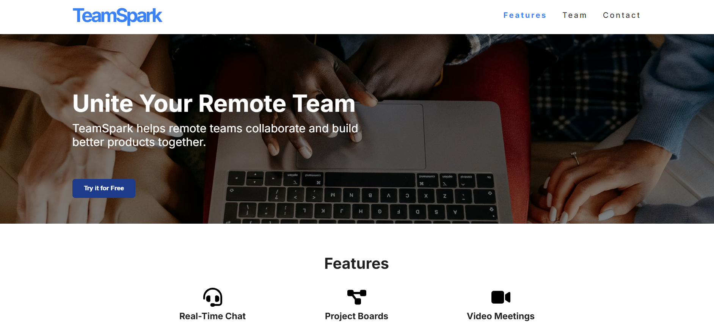

# 🚀 TeamSpark — Remote Collaboration Made Easy

**TeamSpark** is a fully responsive, accessible landing page built using semantic HTML, vanilla CSS, and JavaScript. The site is designed to promote a fictional remote collaboration platform, showcasing clean UI, animation, and SEO best practices — all without frameworks or external UI libraries.

🔗 [Live Demo](https://teamsparkwebsite.netlify.app)  
📖 [Full Case Study](https://mnqobithusi.dev/teamspark-blogpost.html/)  
📸 [Screenshots & Assets](./assets/images)

---

# 📷 Preview!

## ✨ Features

- Accessible mobile-first navigation with scroll-tracked active states
- Scroll-triggered animations (desktop only)
- ARIA-enhanced structure and keyboard navigation
- Lazy-loaded images and performance-tuned animations
- Semantic HTML5 and custom CSS variables
- Open Graph tags + Schema.org structured data (Organization, Person, ItemList)
- Lighthouse Scores: **Performance 99 • Accessibility 92 • SEO 100 • Best Practices 100**

---

## 🔧 Technologies Used

- HTML5 + CSS3 (custom properties, flexbox, grid)
- Vanilla JavaScript (modular scroll + nav logic)
- Inline SVGs (no external icon libraries)
- Netlify for static deployment and caching
- Manual optimization (minification, headers, lazy loading)

---

## 🧠 What I Learned

- Hands-on ARIA + accessibility implementation
- SEO and structured data with JSON-LD
- Layout building using modern grid/flex techniques
- Manual performance tuning without relying on frameworks

---

## 💬 Author

Made with care by [Mnqobi Thusi](https://mnqobithusi.dev)  
Connect on [LinkedIn](https://linkedin.com/in/mnqobi-thusi)

---

> 🚀 *Want to fork this? It’s perfect as a lightweight SaaS starter page.*
